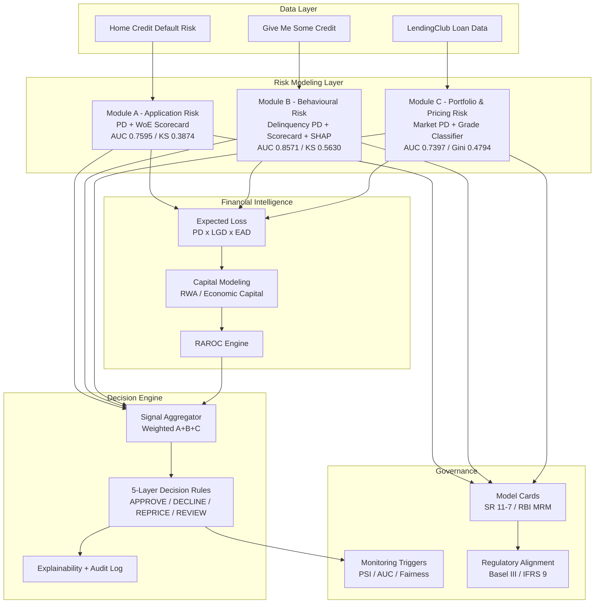

# AI Credit Intelligence System


*Trained credit risk models for application, behavioural, and portfolio/pricing risk - with full SR 11-7 / RBI MRM governance documentation.*

---

An **AI-powered lending risk decision platform** designed to optimize credit growth while maintaining **portfolio risk limits and capital efficiency**.

This project simulates how modern financial institutions use **machine learning, financial risk modeling, and strategy simulation** to automate lending decisions.

The platform integrates:

* Credit risk modeling
* Expected loss estimation
* Capital allocation modeling
* Risk-adjusted return optimization (RAROC)
* Lending strategy simulation
* Stress testing
* Responsible AI governance
* Portfolio monitoring dashboards


---

# 🏗 System Architecture


```
## System Architecture
```



---

## What This Is

A from-scratch credit risk modelling stack covering the three signals a lender needs to underwrite, monitor, and price a loan:

| Module | Risk Type | Dataset | Notebooks & Metrics | Trained Artifacts (`.pkl`) |
|--------|-----------|---------|----------------------|------------------------------|
| **A - Application Risk** | PD at point of application, scorecard, capital/RAROC | Home Credit Default Risk (Kaggle) | ✅ All 7 notebooks run - AUC 0.7595, KS 0.3874 (confirmed, see model card) | ✅ Included (`xgboost_pd.pkl`, `logistic_regression_pd.pkl`, `scorecard_woe_map.pkl`, `scorecard_points.pkl`) |
| **B - Behavioural Risk** | Delinquency probability from 2-year payment history | Give Me Some Credit (Kaggle) | ✅ All 4 notebooks run - AUC 0.8571, KS 0.563 (confirmed) | ✅ Included (`xgb_behavioural.pkl`, `lr_behavioural.pkl`, scorecard, SHAP explainer) |
| **C - Portfolio & Pricing Risk** | Market-calibrated PD, rate adequacy, concentration | LendingClub Loan Data (Kaggle) | ✅ All 3 notebooks run - AUC 0.7397, Gini 0.4794 (confirmed) | ✅ Included (`xgb_default_c.pkl`, `xgb_grade_classifier.pkl`, `grade_pd_lookup.pkl`) |

All confirmed metrics are documented with sample sizes and test-set details in `05_governance/model_cards/`. Each module ships a notebook trail from raw data to scored output, plus SHAP explainability where applicable.

A standalone `04_decision_engine/` combines the three signals into a 5-layer lending decision (APPROVE / DECLINE / REPRICE / MANUAL REVIEW) with full explainability and an audit log - see `04_decision_engine/README_decision_engine.md`.

`05_governance/` documents all three models against SR 11-7, RBI MRM, Basel III and the RBI Fair Practices Code, including a runnable PSI/AUC/fairness monitoring script (`monitoring_triggers.py`).

---

---

# 🚀 Key System Modules

## 1. Credit Risk Modeling

Predict **probability of default (PD)** using machine learning.

Models implemented:

* Logistic Regression
* Random Forest
* XGBoost

Evaluation metrics:

* AUC
* KS Statistic
* Precision / Recall

---

## 2. Expected Loss Engine

Expected loss is calculated using the standard banking formula.

```
Expected Loss = PD × LGD × EAD
```

Where:

| Variable | Meaning                |
| -------- | ---------------------- |
| PD       | Probability of Default |
| LGD      | Loss Given Default     |
| EAD      | Exposure at Default    |

Outputs:

* Loan-level expected loss
* Portfolio expected loss

---

## 3. Capital Modeling

Simulates regulatory capital requirements.

```
RWA = Exposure × Risk Weight
Capital Required = RWA × Capital Ratio
```

Outputs:

* Risk-weighted assets
* Capital utilization
* Capital efficiency metrics

---

## 4. RAROC Engine

Risk Adjusted Return on Capital evaluates whether lending strategies generate economic value.

```
RAROC =
(Net Interest Income − Expected Loss − Operating Cost)
/ Capital Required
```

Used for **strategy comparison and portfolio optimization**.

---

## 5. Strategy Simulator

Simulates multiple lending strategies.

### Aggressive Growth

Higher approvals, higher risk.

### Conservative Filtering

Lower approvals, safer portfolio.

### Risk-Based Pricing

Interest rates adjusted to borrower risk.

Outputs:

* Portfolio NPA
* Expected loss
* Revenue
* Capital usage
* RAROC

---

## 6. Stress Testing Simulator

Evaluates portfolio resilience during economic downturns.

| Scenario      | PD Change | LGD Change |
| ------------- | --------- | ---------- |
| Base Case     | 0%        | 0%         |
| Mild Stress   | +15%      | +5%        |
| Severe Stress | +35%      | +15%       |

Outputs:

* Expected loss under stress
* Capital impact
* Portfolio stability

---

## 7. Decision Engine

Combines risk signals to generate automated lending decisions.

Inputs:

* Credit risk score
* Fraud risk score
* Risk policy thresholds

Possible outcomes:

* Approve
* Reject
* Manual review

---

## 8. Responsible AI Governance

Ensures fairness and transparency.

Includes:

* SHAP explainability
* Feature importance
* Bias monitoring
* Fairness checks

---

## 9. Monitoring Dashboard

Tracks performance after deployment.

Monitors:

* Model drift
* PD distribution shifts
* Performance decay
* Manual override decisions

---

# 📊 Interactive Risk Command Center

The system includes a **Streamlit dashboard** for exploring the platform.

Features:

* KPI tracking
* Model comparison
* Strategy simulator
* Stress testing
* Portfolio analytics
* Project execution tracker

---

## Relationship to NirnayX

This repository is the **model factory**: training notebooks, datasets, and the trained artifacts themselves.

[NirnayX](https://github.com/) is a separate **governance/serving layer** - it doesn't train models, it governs decisions made using models (either a bank's own models via `external_model` mode, or these models via `full_stack` mode). NirnayX's `module_adapters.py` loads the Module A/B/C artifacts produced here as its "internal model" path, with model cards in NirnayX mirroring the confirmed metrics documented in `05_governance/model_cards/` here.

This split mirrors how real institutions separate model development (owned by a model risk / data science team) from model governance and decisioning (owned by a risk platform team) - each independently versioned and reviewed.

---

## Repository Structure

```
01_module_a_application_risk/   PD model, scorecard, EL/capital/RAROC, strategy & stress testing
02_module_b_behavioural_risk/   Delinquency model, behavioural scorecard, SHAP explainability
03_module_c_portfolio_pricing_risk/  Market PD, pricing model, concentration analysis
04_decision_engine/             Combines A/B/C signals into a lending decision (standalone demo)
05_governance/                  Model cards, regulatory alignment, monitoring triggers
06_docs/                        Rendered project overview (README.html)
```

## Running the Decision Engine Demo

```bash
cd 04_decision_engine
python 05_demo.py                # all 4 preset applicant profiles
python 05_demo.py --profile ANAND_MEHTA
```

## Running the Monitoring System

```bash
cd 05_governance
python monitoring_triggers.py --export
```

## Setup

```bash
pip install -r requirements.txt
```
# 📚 Datasets Used

Public lending datasets used for modeling.

* Home Credit Default Risk - primary credit risk modeling dataset.
* LendingClub Loan Data - strategy simulation and portfolio analysis.
* Give Me Some Credit - fraud/anomaly style modeling and risk signals.

These datasets provide structured borrower information for credit risk modeling.

---

# 🧰 Technologies Used

Programming

* Python

Machine Learning

* Scikit-learn
* XGBoost

Data Processing

* Pandas
* NumPy

Visualization

* Matplotlib
* Streamlit

Explainability

* SHAP

---

# 🎯 Target Performance Metrics

| Metric              | Target |
| ------------------- | ------ |
| AUC                 | ≥ 0.80 |
| KS Statistic        | ≥ 0.40 |
| Portfolio NPA       | ≤ 5%   |
| RAROC               | ≥ 18%  |
| Capital Utilization | < 85%  |

---

# 🔮 Future Improvements

Possible extensions include:

* Real-time lending decision API
* Reinforcement learning for strategy optimization
* Advanced capital stress testing
* Dynamic portfolio allocation
* Regulatory compliance simulation

---

# 👩‍💻 Author

**Hiral Sarkar**

AI & Risk Analytics Enthusiast
Building **AI-driven financial decision systems for banking and fintech**.

---

# 📜 License

This project is intended for **educational and portfolio demonstration purposes**.

---

## ⭐ If you find this project interesting, consider starring the repository!

---

Raw Kaggle datasets are not included (see each module's README for download links and `01_data/raw/` placement). Processed datasets and trained model artifacts for all three modules (A, B, and C) are included so the decision engine and monitoring scripts run out of the box without re-running notebooks.
