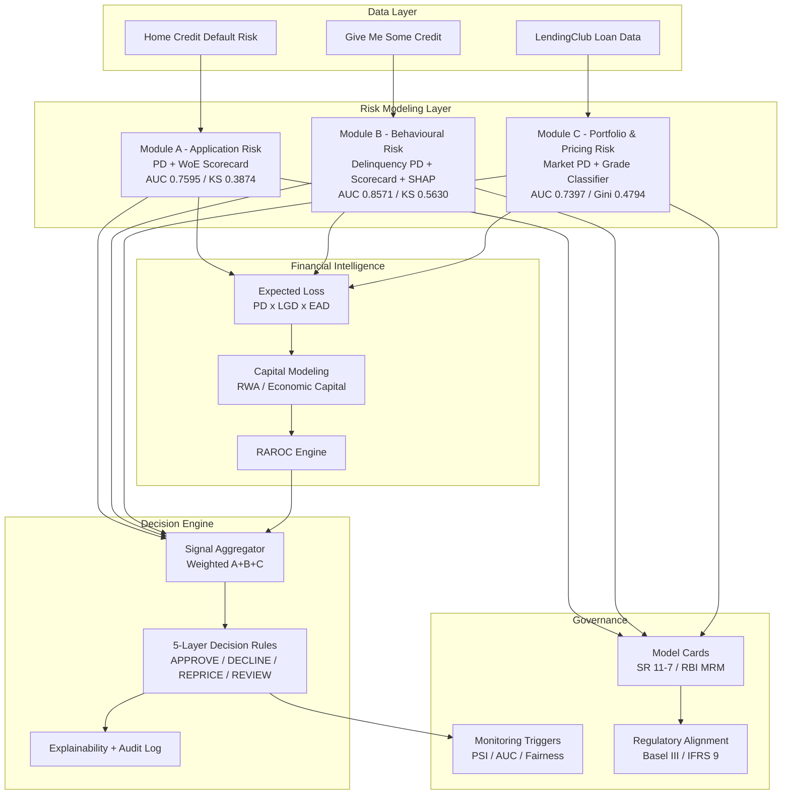

# AI Credit Intelligence System


*Trained credit risk models for application, behavioural, and portfolio/pricing risk - with full SR 11-7 / RBI MRM governance documentation.*

---

## System Architecture



---

## What This Is

A from-scratch credit risk modelling stack covering the three signals a lender needs to underwrite, monitor, and price a loan:

| Module | Risk Type | Dataset | Notebooks & Metrics | Trained Artifacts (`.pkl`) |
|--------|-----------|---------|----------------------|------------------------------|
| **A - Application Risk** | PD at point of application, scorecard, capital/RAROC | Home Credit Default Risk (Kaggle) | ✅ All 7 notebooks run - AUC 0.7595, KS 0.3874 (confirmed, see model card) | ✅ Included (`xgboost_pd.pkl`, `logistic_regression_pd.pkl`, `scorecard_woe_map.pkl`, `scorecard_points.pkl`) |
| **B - Behavioural Risk** | Delinquency probability from 2-year payment history | Give Me Some Credit (Kaggle) | ✅ All 4 notebooks run - AUC 0.8571, KS 0.563 (confirmed) | ✅ Included (`xgb_behavioural.pkl`, `lr_behavioural.pkl`, scorecard, SHAP explainer) |
| **C - Portfolio & Pricing Risk** | Market-calibrated PD, rate adequacy, concentration | LendingClub Loan Data (Kaggle) | ✅ All 3 notebooks run - AUC 0.7397, Gini 0.4794 (confirmed) | ✅ Included (`xgb_default_c.pkl`, `xgb_grade_classifier.pkl`, `grade_pd_lookup.pkl`) |

All confirmed metrics are documented with sample sizes and test-set details in `05_governance/model_cards/`. Each module ships a notebook trail from raw data to scored output, plus SHAP explainability where applicable.

A standalone `04_decision_engine/` combines the three signals into a 5-layer lending decision (APPROVE / DECLINE / REPRICE / MANUAL REVIEW) with full explainability and an audit log - see `04_decision_engine/README_decision_engine.md`.

`05_governance/` documents all three models against SR 11-7, RBI MRM, Basel III and the RBI Fair Practices Code, including a runnable PSI/AUC/fairness monitoring script (`monitoring_triggers.py`).

---

## Relationship to NirnayX

This repository is the **model factory**: training notebooks, datasets, and the trained artifacts themselves.

[NirnayX](https://github.com/) is a separate **governance/serving layer** - it doesn't train models, it governs decisions made using models (either a bank's own models via `external_model` mode, or these models via `full_stack` mode). NirnayX's `module_adapters.py` loads the Module A/B/C artifacts produced here as its "internal model" path, with model cards in NirnayX mirroring the confirmed metrics documented in `05_governance/model_cards/` here.

This split mirrors how real institutions separate model development (owned by a model risk / data science team) from model governance and decisioning (owned by a risk platform team) - each independently versioned and reviewed.

---

## Repository Structure

```
01_module_a_application_risk/   PD model, scorecard, EL/capital/RAROC, strategy & stress testing
02_module_b_behavioural_risk/   Delinquency model, behavioural scorecard, SHAP explainability
03_module_c_portfolio_pricing_risk/  Market PD, pricing model, concentration analysis
04_decision_engine/             Combines A/B/C signals into a lending decision (standalone demo)
05_governance/                  Model cards, regulatory alignment, monitoring triggers
06_docs/                        Rendered project overview (README.html)
```

## Running the Decision Engine Demo

```bash
cd 04_decision_engine
python 05_demo.py                # all 4 preset applicant profiles
python 05_demo.py --profile ANAND_MEHTA
```

## Running the Monitoring System

```bash
cd 05_governance
python monitoring_triggers.py --export
```

## Setup

```bash
pip install -r requirements.txt
```

Raw Kaggle datasets are not included (see each module's README for download links and `01_data/raw/` placement). Processed datasets and trained model artifacts for all three modules (A, B, and C) are included so the decision engine and monitoring scripts run out of the box without re-running notebooks.
