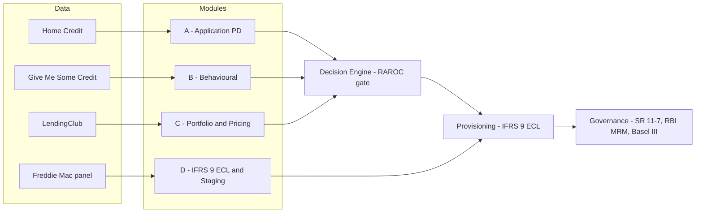

# AI Credit Intelligence System


> A full-lifecycle credit risk system engineered to **beat the incumbent underwriting process on approval rate and default rate at the same time**, then price, provision, and collect on that book more efficiently. Built on four real datasets, with model risk governance to institutional standard.

The deliverable is not a higher Gini. It is a **superior business frontier**: approve more good borrowers and fewer bad ones than the process a lender runs today, and reduce credit losses across the book's life.

---

## Headline result

On a held-out test set of 61,503 loans, a custom PD model is benchmarked against the incumbent bureau-score process it would replace.

| | Incumbent (Champion) | Custom (Challenger) |
|---|---|---|
| Discrimination (AUC) | 0.718 | **0.756** |
| At matched volume | 3.69% default | **2.95% default** (−20%) |
| At matched risk | 50% approval | **63.6% approval** (+27%) |

**Recommended operating point (SC3): 61.9% approval, 3.61% default, +₹176 cr net income, +93.4% portfolio RAROC** - higher approval *and* lower default than the incumbent, simultaneously. The income-maximising point within risk appetite sits at 63.7%; the recommended point is held one step inside it to strictly beat the incumbent on every metric.

---

## System architecture



The PD model estimates risk; the **RAROC gate** sets policy on the dominating frontier; the **IFRS 9 engine** turns staging into a provisioning decision; **governance** closes the loop with monitoring and regulatory alignment.

---

## The four risk modules

Each module benchmarks a custom Challenger against the incumbent it replaces, and wins on discrimination and on the business outcome.

| Module | Question | Incumbent | Custom | Business win |
|---|---|---|---|---|
| **A** Application | Who to approve? | Bureau score (0.718) | Full PD model (**0.756**) | +27% volume / −20% default |
| **B** Behavioural | How is the borrower behaving? | Past-DPD rule (0.768) | Behavioural ML (**0.860**) | catches 81% vs 71% of delinquents |
| **C** Portfolio | Is the rate right? | FICO + grade (0.705) | Full model (**0.729**) | +3.7pp approval / −4.9% default |
| **D** ECL & Staging | What is the lifetime loss? | Snapshot proxy | Panel staging on 12.6M loan-months | **39x** Stage 1 to Stage 2 provisioning cliff, real LGD 41.8% |

Module D's transition matrix (28.5% monthly Stage 2 to Stage 1 cure rate) and vintage curves (2008 crisis 6.0% vs 2011 1.1% default) drive the IFRS 9 ECL-reduction case: better origination keeps loans in Stage 1, and collections cure Stage 2 back before the lifetime-ECL cliff.

---

## Repository structure

```
01_module_a_application_risk/        Module A - origination PD, scorecard, RAROC, swap-set
02_module_b_behavioural_risk/        Module B - delinquency model, collections capture
03_module_c_portfolio_pricing_risk/  Module C - grade / market-implied PD, pricing
04_module_d_ecl_ifrs9/               Module D - IFRS 9 staging, transition matrix, lifetime ECL
04_decision_engine/                  Composite signal, RAROC gate, audit trail
05_governance/                       Model cards, SR 11-7, RBI MRM, regulatory alignment
06_docs/                             Executive deliverables and methodology (HTML)
```

Each module follows the same layout: `01_data/` (raw is gitignored, download separately), `02_notebooks/`, `03_models/`, `04_outputs/`.

---

## Reproducibility

```bash
pip install -r requirements.txt
# place the raw datasets in each module's 01_data/raw/ (see module READMEs)
python 01_module_a_application_risk/_pipeline_a.py        # PD model, swap-set, scored output
python 01_module_a_application_risk/_economics_a.py       # EL, economic capital, RAROC by band
python 04_module_d_ecl_ifrs9/_pipeline_d.py               # IFRS 9 staging, transition matrix, ECL
```

Every figure in the documentation is regenerated by these pipelines on a fixed seed.

---

## Governance and standards

- **SR 11-7** - model development, validation, monitoring; champion vs challenger; audit trail.
- **RBI MRM** - model inventory, risk-tier classification, model cards per module.
- **Basel III / ICAAP** - EL, RWA, economic capital, four-scenario stress testing.
- **IFRS 9** - Stage 1 / 2 / 3 allocation, lifetime PD from the survival curve, ECL by stage.
- **Fair Practices** - adverse-action notices with plain-language reason codes.

## Data

Home Credit Default Risk · Give Me Some Credit · LendingClub 2007-2018 · Freddie Mac Single-Family Loan Performance (2008-2011). Raw files are downloaded separately and are not committed.

---

*A risk project: reduce risk, increase real profitability. Every figure is defensible to a Chief Risk Officer and traces to an executed pipeline.*
