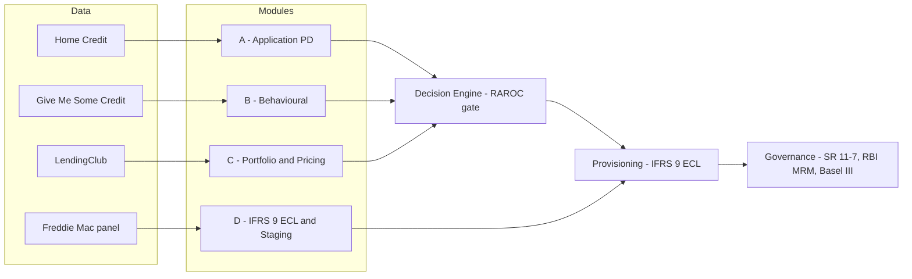

# AI Credit Intelligence System


[](https://github.com/hiralsarkar/AI-Credit-Intelligence-System/actions/workflows/ci.yml)

> A full-lifecycle credit-risk study: originate, price, provision, and collect, built on four real public datasets using standard model-risk-governance conventions (SR 11-7, RBI MRM, Basel III, IFRS 9). Each model is measured against a simple baseline, a bureau-score cutoff and its equivalents, the kind of benchmark a lender relies on before it builds a full custom scorecard.

The deliverable is not a higher Gini. It is a better business frontier: at the benchmark's operating point, approve more good borrowers and fewer bad ones, and reduce credit losses across the book's life.

> **Scope note:** the "Champion" throughout is a bureau-score benchmark, not a mature lender's production scorecard. The results show the lift a custom model adds over a generic bureau score. They are not a claim to beat an established underwriting process. See [Scope and honest limitations](#scope-and-honest-limitations).

---

## Headline result

On a held-out test set of 61,503 loans, a custom PD model is benchmarked against a bureau-score cutoff, the baseline a lender uses before a full scorecard exists.

| | Bureau-score benchmark (Champion) | Custom (Challenger) |
|---|---|---|
| Discrimination (AUC) | 0.718 | **0.756** |
| At matched volume | 3.69% default | **2.95% default** (-20%) |
| At matched risk | 50% approval | **63.6% approval** (+27%) |

**Recommended operating point (SC3): 61.9% approval, 3.61% default, +₹176 cr net income, +93.4% portfolio RAROC** - higher approval *and* lower default than the bureau-score benchmark, simultaneously. The income-maximising point within risk appetite sits at 63.7%; the recommended point is held one step inside it to strictly beat the benchmark on every metric.

---

## System architecture


```mermaid
flowchart LR
  subgraph Data
    D1[Home Credit]
    D2[Give Me Some Credit]
    D3[LendingClub]
    D4[Freddie Mac panel]
  end
  subgraph Modules
    A[A - Application PD]
    B[B - Behavioural]
    C[C - Portfolio and Pricing]
    E[D - IFRS 9 ECL and Staging]
  end
  G[Decision Engine - RAROC gate]
  P[Provisioning - IFRS 9 ECL]
  GV[Governance - SR 11-7, RBI MRM, Basel III]

  D1 --> A
  D2 --> B
  D3 --> C
  D4 --> E
  A --> G
  B --> G
  C --> G
  G --> P
  E --> P
  P --> GV
```

The PD model estimates risk; the **RAROC gate** sets policy on the frontier; the **IFRS 9 engine** turns staging into a provisioning decision; **governance** closes the loop with monitoring and regulatory alignment. The four modules are trained on four independent datasets; the decision engine that combines their signals is a reference architecture, not a single scored book (see limitations).

---

## The four risk modules

Each module measures a custom Challenger against a simple benchmark, the kind of baseline a lender uses before building a custom model, and reports the lift on discrimination and on the business outcome.

| Module | Question | Benchmark (Champion) | Custom | Lift vs benchmark |
|---|---|---|---|---|
| **A** Application | Who to approve? | Bureau score (0.718) | Full PD model (**0.756**) | +27% volume / -20% default |
| **B** Behavioural | How is the borrower behaving? | Past-DPD rule (0.768) | Behavioural ML (**0.860**) | catches 81% vs 71% of delinquents |
| **C** Portfolio | Is the rate right? | FICO + grade (0.705) | Full model (**0.729**) | +3.7pp approval / -4.9% default |
| **D** ECL & Staging | What is the lifetime loss? | Snapshot proxy | Panel staging on 12.6M loan-months | **39x** Stage 1 to Stage 2 provisioning cliff, real LGD 41.8% |

Module D's transition matrix (28.5% monthly Stage 2 to Stage 1 cure rate) and vintage curves (2008 crisis 6.0% vs 2011 1.1% default) drive the IFRS 9 ECL-reduction case: better origination keeps loans in Stage 1, and collections cure Stage 2 back before the lifetime-ECL cliff.

---

## Repository structure

```
01_module_a_application_risk/        Module A - origination PD, scorecard, RAROC, swap-set
02_module_b_behavioural_risk/        Module B - delinquency model, collections capture
03_module_c_portfolio_pricing_risk/  Module C - grade / market-implied PD, pricing
04_module_d_ecl_ifrs9/               Module D - IFRS 9 staging, transition matrix, lifetime ECL
04_decision_engine/                  Composite signal, RAROC gate, audit trail
05_governance/                       Model cards, SR 11-7, RBI MRM, regulatory alignment
06_docs/                             Executive deliverables and methodology (HTML)
```

Each module follows the same layout: `01_data/` (raw is gitignored, download separately), `02_notebooks/`, `03_models/`, `04_outputs/`.

---

## Run it

The decision engine runs with **no data download**:

```bash
pip install -r requirements.txt
python 04_decision_engine/demo.py     # scores 4 sample applicants end to end
```

To regenerate every figure from raw data, place the datasets (see [Data](#data)) and run:

```bash
python run_all.py            # runs the module pipelines in order, on a fixed seed
python run_all.py --check    # lists which raw datasets are present / missing first
python tools/run_notebooks.py  # re-execute notebooks whose data is present (refreshes outputs)
```

`run_all.py` skips any module whose raw data is absent and tells you where to get it, so a partial checkout still runs what it can. Every figure in the documentation is regenerated by these pipelines on a fixed seed (42).

---

## Scope and honest limitations

This is a portfolio study on public data, built to institutional conventions. Read the results with these caveats, which the analysis itself states rather than hides:

- **The Champion is a bureau-score benchmark, not a production scorecard.** The lift shown is over a generic bureau-score cutoff, the baseline before a custom model exists. It is not a claim to beat a mature lender's existing underwriting.
- **The integration is illustrative.** The four modules train on four unrelated public datasets (different borrowers, geographies, eras). The composite PD and decision engine show *how* the signals would combine; they are a reference architecture, not one book scored end to end.
- **Module A's origination "staging" is a PD-bucket proxy, not SICR-based IFRS 9 staging.** A single application snapshot cannot express a significant increase in credit risk. All credible IFRS 9 staging in this project is Module D, on the Freddie Mac monthly panel.
- **The collections uplift / next-best-action model is exploratory.** It uses loan modification as an observed (not randomised) treatment, so the effect is confounded, and its uplift-decile validation is not yet monotonic. Treat it as a targeting hypothesis, not a causal result.
- **Data is public Kaggle / Freddie Mac.** Figures are realistic and reproducible, but they describe these datasets, not a live portfolio.

---

## Governance and standards

Built to the following conventions (not a formal validation):

- **SR 11-7** - model development, validation, monitoring; champion vs challenger; audit trail.
- **RBI MRM** - model inventory, risk-tier classification, model cards per module.
- **Basel III / ICAAP** - EL, RWA, economic capital, four-scenario stress testing.
- **IFRS 9** - Stage 1 / 2 / 3 allocation, lifetime PD from the survival curve, ECL by stage.
- **Fair Practices** - adverse-action notices with plain-language reason codes.

## Data

Home Credit Default Risk · Give Me Some Credit · LendingClub 2007-2018 · Freddie Mac Single-Family Loan Performance (2008-2011). Raw files are downloaded separately and are not committed.

---

*A portfolio study in credit risk: reduce risk, increase real profitability. Every figure traces to an executed pipeline and is built to standard risk conventions.*
